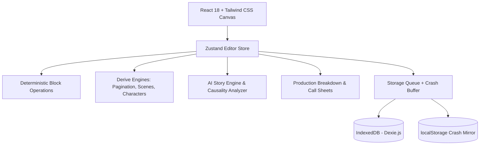

# SCRIPT FLOW 🎬
### The World's Premier Screenwriting & Production Intelligence Suite
**Created with craft & passion by Naveen Sai**

[](LICENSE)
[](https://www.typescriptlang.org/)
[](https://reactjs.org/)
[](https://vitejs.dev/)
[](#anti-ai-slop-design-philosophy)

---

## 🌟 Overview

**ScriptFlow** is a professional, production-complete screenwriting workstation engineered to surpass legacy suites like Final Draft, Fade In, and Arc Studio Pro. Built from the ground up to serve everyone from independent screenwriters in Hyderabad and Mumbai to Oscar-winning Hollywood filmmakers.

ScriptFlow eliminates the fatal flaws of modern writing software: **zero cloud lock-in, zero subscription fatigue, zero crashes, zero data loss, and zero formulaic AI plot generation.**

---

## 💎 Features Across 5 Levels

### Level 1: Screenwriting Foundation
* **Tab-and-Enter Flow**: Intuitive cycling through standard screenplay elements (*Scene Heading, Action, Character, Parenthetical, Dialogue, Transition*).
* **Live Dynamic Pagination**: Standard industry ~54-line calculation engine with live page break dividers and scene page markers.
* **Dual Dialogue**: Seamless side-by-side simultaneous speech with one-click toggling.
* **Scene Numbering**: Industry standard scene numbers displayed on left and right margins of scene headings (`23`, `23A`, `23B`) with lock toggle.
* **Named Revision Snapshots**: Capture immutable screenplay milestones (*e.g., "Pre-Table Read Polish"*) with instant one-click restoration.
* **Multi-Format Import & Export**: Import/Export **Final Draft (.fdx)**, **Fountain (.fountain)**, **PDF with Title Page**, JSON, and watermarked drafts.
* **Crash-Proof Local-First Persistence**: Dual-layer architecture combining **IndexedDB (Dexie.js)** with synchronous crash-recovery localStorage buffers.

### Level 2: The Focused Writing Experience
* **Typewriter Mode**: Centers the active line at the 50% viewport level, keeping the writer's gaze fixed at natural eye height.
* **Warm Celluloid Night Mode**: An amber-sepia night theme engineered to reduce visual fatigue during late-night writing sprints without harsh blue light.
* **Distraction-Free Zen Mode**: Fullscreen writing canvas that hides all menus, sidebars, and notifications.
* **Scratch Pad & Bin Drawer**: Slide-out tray to stash excised dialogue, alternative twists, and brainstorm snippets without losing them.
* **Visual Corkboard**: Drag-and-drop index cards with color tags, act groupings, and synopsis notes.
* **Outline Navigator**: Instant scene-jumping sidebar with filterable character presence.

### Level 3: Anti-AI-Slop Story Intelligence
* **Non-Linear Causality Engine**: Analyzes screen presentation order against chronological story time. Understands flashbacks, flash-forwards, and parallel timelines as deliberate narrative craft—**never falsely flagging twists as plot holes**.
* **Beat Sheet Generator**: Formats story milestones across 4 industry frameworks:
  * *Blake Snyder's Save the Cat!* (15 Beats)
  * *Joseph Campbell's Hero's Journey* (12 Stages)
  * *Dan Harmon's Story Circle* (8 Steps)
  * *Classic Three-Act Structure* (8 Milestones)
* **Anti-Formulaic Dialogue Sparks**: Curated high-subtext scene prompts designed to blast through writer's block with character trade-offs, secrets, and dilemmas.

### Level 4: The Production Suite
* **Production Breakdown Engine**: Scans every scene in real-time to categorize:
  * **Cast Members** (speaking roles & occurrences)
  * **Sets & Locations** (INT/EXT classification)
  * **Props** (weapons, documents, technology)
  * **Wardrobe** (uniforms, costumes, disguises)
  * **Vehicles** (cars, motorcycles, aircraft)
  * **Stunts & FX** (explosions, gunplay, brawls)
* **Daily Call Sheet Generator**: Auto-generates standard call sheets with shoot dates, call times, location specs, cast call schedules, and director notes.
* **WGA Revision Colors**: 9 industry standard draft colors (*White, Blue, Pink, Yellow, Green, Goldenrod, Buff, Salmon, Cherry*) with right-margin revision asterisks.
* **Real-Time Writers Room**: Interactive multi-cursor collaboration simulation with encrypted room codes and in-app pitch channel.

### Level 5: Delighters
* **Native Voice Dictation**: Hands-free dialogue drafting using the browser Web Speech API.
* **Visual Moodboard**: Collect cinematic textures, lighting references, and color hex swatches directly attached to your project.
* **Pomodoro Sprint Timer & Word Targets**: 15/25/45/60-minute focused writing intervals with live word count tracking.
* **Template Library**: Production-ready starter templates for **Feature Film (3-Act Spec)**, **60-Min TV Drama (Pilot)**, **30-Min TV Sitcom**, **Short Film**, and **Stage Play**.

---

## 🎨 Anti-AI-Slop Design Philosophy

ScriptFlow strictly rejects the generic aesthetic of "AI wrapper" websites:
* ❌ **No Inter, Roboto, or Arial**: Typography is anchored by **Space Grotesk** (editorial headlines), **Fraunces** (optical serif nuance), and **Courier Prime** (12pt screenplay standard).
* ❌ **No Purple/Indigo Gradients**: Colors are grounded in classic film stocks: Kodak gold amber (`#B45309`), celluloid obsidian (`#12110F`), and warm paper (`#FBF9F4`).
* ❌ **No Centered 3-Card Heroes**: Every button and layout element is built with purpose for actual professional writers.

---

## 🛠️ Architecture & Tech Stack



* **Frontend**: React 18, TypeScript, Tailwind CSS, Lucide React
* **State Management**: Zustand
* **Local-First Database**: Dexie.js (IndexedDB)
* **Testing**: Vitest (30 Unit Tests across 10 suites)
* **Build Tooling**: Vite 6, Vite PWA Service Worker (offline-ready)

---

## 🚀 Quick Start

### Prerequisites
* **Node.js**: v18.0 or higher
* **npm**: v9.0 or higher

### Installation

```bash
# Clone the repository
git clone https://github.com/naveensai/scriptflow.git
cd scriptflow

# Install dependencies
npm install

# Start development server
npm run dev

# Run unit tests
npm test

# Build production bundle
npm run build
```

---

## ⌨️ Essential Keyboard Shortcuts

| Shortcut | Action |
|---|---|
| `Tab` | Cycle Block Type (*Action → Character → Parenthetical → Dialogue → Transition → Heading*) |
| `Shift + Tab` | Cycle Block Type backwards |
| `Alt + 1..7` | Directly select element type |
| `Enter` | Smart split & contextual element advance |
| `Backspace` (at start) | Merge with previous block |
| `Ctrl + S` | Force instant save to disk |
| `Ctrl + Z` / `Ctrl + Shift + Z` | Infinite Undo / Redo |
| `Ctrl + 0` | Toggle Structure Sidebar |
| `Ctrl + P` | Print / Export PDF |
| `F11` | Fullscreen Zen Mode |

---

## 📄 License & Creator

Created by **Naveen Sai**.  
Distributed under the **MIT License**. See [LICENSE](LICENSE) for details.

